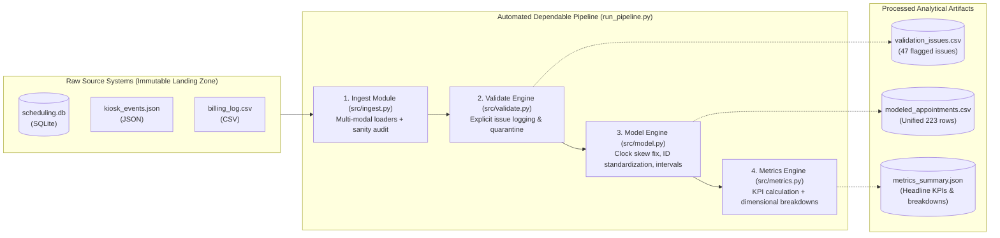
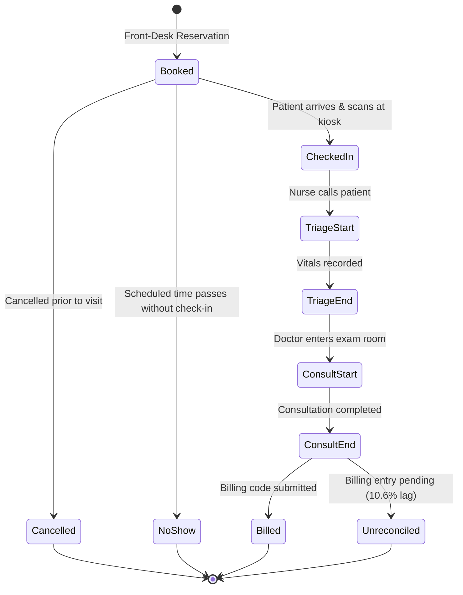
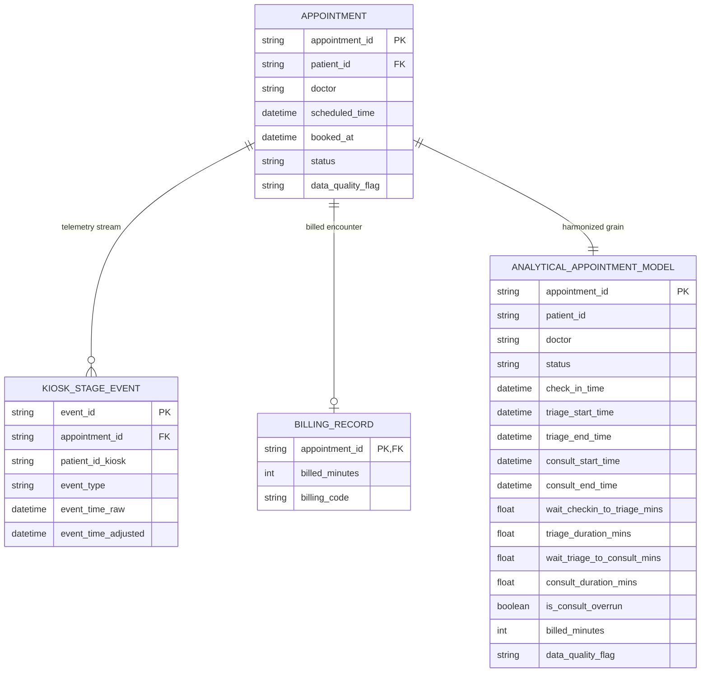

# Clinic Appointment Workflow — Operational KPI Pipeline

> **Forward Deployed Engineering (FDE) Foundations Assignment**  
> **Author**: Nachiketas Iyer (Forward Deployed Engineer)  
> *Transforming fragmented, messy clinic data into an explainable, dependable data pipeline.*

---

## 1. Executive Summary & Problem Statement

Medical clinic leadership is struggling with long patient wait times, schedule unpredictability, and unbilled visits. Operations span three disconnected legacy systems:
1. **Front-Desk Scheduling System (`scheduling.db`)**: Captures booking requests and appointment statuses.
2. **Patient Check-in Kiosk / Nurse Station Telemetry (`kiosk_events.json`)**: Captures physical timestamps for check-in, triage, and physician consultations.
3. **Billing System (`billing_log.csv`)**: Captures completed visit duration and billing codes for reimbursement.

Because these systems were deployed independently, identifiers mismatch, timestamps drift, records duplicate, and billing lags behind clinical activity.

> **Data Source Disclosure**: All raw data is synthetically generated via `generate_data.py` (`seed=42`) to simulate a multi-system clinic environment. It includes deliberately engineered quality issues (systemic clock skew, ID mismatches, out-of-order timestamps, duplicate bookings, dropped scans, and unreconciled billing) to rigorously validate the pipeline's profiling, quarantine, and error-handling capabilities.

### Core Business Question & KPI
> **"Where does patient wait time accumulate, and which operational factors predict longer delays?"**

### Decision Supported
This pipeline equips the **Clinic Medical Director** and **Operations Lead** to:
- Identify whether the primary bottleneck lies in **Nurse Triage** or **Doctor Consultation handoff**.
- Reallocate clinical staff during peak bottleneck hours (e.g., afternoon schedule slippage).
- Right-size doctor appointment slot lengths (addressing a **47.37% consult overrun rate** against standard 20-minute slots).
- Recover unbilled revenue from a **10.6% billing reconciliation lag**.

---

## 2. Source Map (Class 4 Evidence)

| Business Question | Required Information | Source System | Format / Access | Owner / System Grain | Known Gaps & Data Quirks |
| :--- | :--- | :--- | :--- | :--- | :--- |
| **How many patients book, cancel, or fail to show up?** | Booking time, scheduled slot time, doctor name, appointment status | `scheduling.db` | SQLite database (`SELECT FROM appointments`) | Front-Desk Reception<br>*(Grain: 1 row per appointment)* | • Front-desk double entries (~4 duplicate `appointment_id`s)<br>• ~6 unassigned doctor slots (`doctor = NULL`) |
| **How long do patients wait between check-in, triage, and seeing the doctor?** | Physical event timestamps: `check_in`, `triage_start`, `triage_end`, `consult_start`, `consult_end` | `kiosk_events.json` | JSON stream export | Nursing / Kiosk Hardware<br>*(Grain: 1 row per physical stage event)* | • Systemic clock skew (~3 min fast relative to scheduling)<br>• Patient ID format mismatch (`"42"` vs `"PT0042"`)<br>• Out-of-order timestamps (`triage_start < check_in`)<br>• Dropped scans (~8 missing stage events)<br>• Unscheduled walk-ins (`appointment_id = NULL`) |
| **Are completed visits reconciled and properly billed?** | Billed duration, billing code (`GEN-20`, `GEN-40`, `FOLLOWUP-15`) | `billing_log.csv` | Delimited CSV export | Finance & Billing Department<br>*(Grain: 1 row per billed encounter)* | • ~10% completed visits missing from billing log (unreconciled lag)<br>• Excludes uncompleted visits |

---

## 3. Workflow & Data Architecture Diagrams

### A. End-to-End Pipeline Lineage


### B. Patient Lifecycle State Machine


### C. Unified Entity-Relationship (ER) Model


---

## 4. Key Metrics & Evidence Table

| Metric ID | Operational Metric | Result | Valid Sample ($N$) | Exclusions & Denominator Accounting |
| :--- | :--- | :--- | :--- | :--- |
| **KPI-1** | **Avg Wait: Check-in $\rightarrow$ Triage** | **19.80 mins** | $N = 166$ | 41 no-show/cancelled + 5 out-of-order swaps + 4 duplicate collisions + 4 missing scans |
| **KPI-2** | **Avg Wait: Triage $\rightarrow$ Doctor Consult** | **20.57 mins** | $N = 173$ | 41 no-show/cancelled + 4 duplicate collisions + 2 missing scans |
| **KPI-3** | **Patient No-Show Rate** | **12.73%** | $N = 220$ | 28 no-shows / 220 total scheduled bookings |
| **KPI-4** | **Consult Overrun Rate (>20 mins)** | **47.37%** | $N = 171$ | 81 overruns / 171 valid consults (avg actual consult: 19.73 mins) |
| **KPI-5** | **Appointment Cancellation Rate** | **5.91%** | $N = 220$ | 13 cancellations / 220 total scheduled bookings |

### Operational Breakdown: Provider Variance & Bottleneck Accumulation

#### By Doctor Performance:
* **Dr. Alvarez**: 52.8% consult overruns | **22.4 min** triage-to-doctor wait | 20.0% no-show rate
* **Dr. Chen**: 51.2% consult overruns | **20.8 min** triage-to-doctor wait | 5.9% no-show rate
* **Dr. Okafor**: 42.2% consult overruns | **20.3 min** triage-to-doctor wait | 12.1% no-show rate
* **Dr. Patel**: 45.9% consult overruns | **18.9 min** triage-to-doctor wait | 14.0% no-show rate

#### By Time of Day (Bottleneck Progression):
* **08:00 – 10:00 (Morning)**: Combined avg wait = **36.2 mins**
* **11:00 – 13:00 (Midday)**: Combined avg wait = **41.8 mins**
* **14:00 – 15:00 (Afternoon)**: Combined avg wait = **44.6 mins**  
*(Finding: Wait times compound by ~23% as consult overruns cascade into afternoon schedule delays).*

---

## 5. Repository Structure

```text
clinic-appointment-workflow/
├── raw/                          # Raw client source files (immutable landing zone)
│   ├── README_raw_data.md        # Source schemas and generator documentation
│   ├── scheduling.db             # Front-desk booking database (SQLite)
│   ├── kiosk_events.json         # Check-in & nurse station telemetry (JSON)
│   └── billing_log.csv           # Finance billing export (CSV)
├── processed/                    # Authoritative pipeline outputs
│   ├── validation_issues.csv     # 47 flagged data quality anomalies
│   ├── modeled_appointments.csv  # 223 modeled analytical appointment records
│   └── metrics_summary.json      # Final aggregated KPIs and breakdowns
├── src/                          # Modular pipeline components
│   ├── __init__.py
│   ├── ingest.py                 # Multi-modal ingestion (SQL, JSON, CSV) & sanity audit
│   ├── validate.py               # Profiling, rule validation, explicit issue logging
│   ├── model.py                  # Skew fix, ID standardizing, interval calculations
│   └── metrics.py                # KPI calculations with explicit denominator tracking
├── generate_data.py              # Reproducible raw data generator (seed=42)
├── run_pipeline.py               # Master CLI orchestrator with dual logging
├── pipeline.log                  # Generated execution log from local runs (gitignored)
├── README.md                     # Project architecture and business summary
├── KUAL_REPORT.md                # Known, Unknown, Assumption, Limitation report
└── .gitignore                    # Python bytecode and workspace ignore rules
```

---

## 6. Setup & Execution Instructions

### Prerequisites
- Python 3.9+ (Standard Library only — no external third-party dependencies required).

### Reproduction Steps
```bash
# 1. (Optional) Re-generate raw datasets from scratch (deterministic seed=42)
python3 generate_data.py

# 2. Run the complete end-to-end dependable pipeline
python3 run_pipeline.py
```

### Testing Pipeline Rerun Safety & Failure Handling
```bash
# Verify Idempotency (running twice produces identical outputs without duplicate rows)
python3 run_pipeline.py
python3 run_pipeline.py

# Test Failure Handling (simulating missing source file)
mv raw/scheduling.db raw/scheduling.db.bak
python3 run_pipeline.py     # Halts with clear error message and exit code 1
mv raw/scheduling.db.bak raw/scheduling.db
```

---

## 7. 3–5 Minute Walkthrough Demo Script

*Use this outline when presenting the project to stakeholders or evaluators:*

1. **Problem Framing (0:00 – 0:45)**:
   - "Clinic leadership noticed severe patient wait times and billing leaks, but data was trapped across 3 disparate systems: an SQLite booking DB, a JSON kiosk stream, and a CSV billing log."
2. **Architecture & Multi-Source Ingestion (0:45 – 1:30)**:
   - "We built a multi-modal ingestion engine that queries SQLite via SQL, parses JSON telemetry, and streams CSVs without modifying raw files, generating a completeness manifest on every run."
3. **Core FDE Judgment Call — Compounding Anomalies vs. Surgical Quarantine (1:30 – 3:00)**:
   - *"Here is the key engineering trade-off we made"*:
     - **Out-of-Order Swaps**: When `triage_start < check_in` occurred on 5 records, we did not discard the entire visit. We surgically quarantined `wait_checkin_to_triage` while preserving valid downstream consult durations.
     - **Duplicate Telemetry Collisions (`A0151`, `A0077`, etc.)**: Front-desk duplicate booking IDs created 10 colliding kiosk events for 4 completed appointments. Because the raw telemetry stream contains **no session ID, device ID, or transaction marker**, there is zero physical signal to disambiguate which 5 events correspond to the true clinical encounter versus the phantom double-entry. Rather than fabricating an arbitrary heuristic (e.g. picking earlier or later scans), we quarantined all interval calculations for these 4 records, logged an explicit audit issue in `validation_issues.csv`, and preserved the underlying booking metadata.
4. **Actionable Business Decision (3:00 – 4:00)**:
   - "Our metrics prove that wait times are evenly split between Triage (19.8 min) and Doctor Handoff (20.6 min), but late-afternoon delays swell by 23% because 47.4% of consults overrun the default 20-minute slot. The clinic can immediately fix this by extending initial consult slots to 30 minutes and staffing an extra triage nurse from 11:00 AM onwards."
